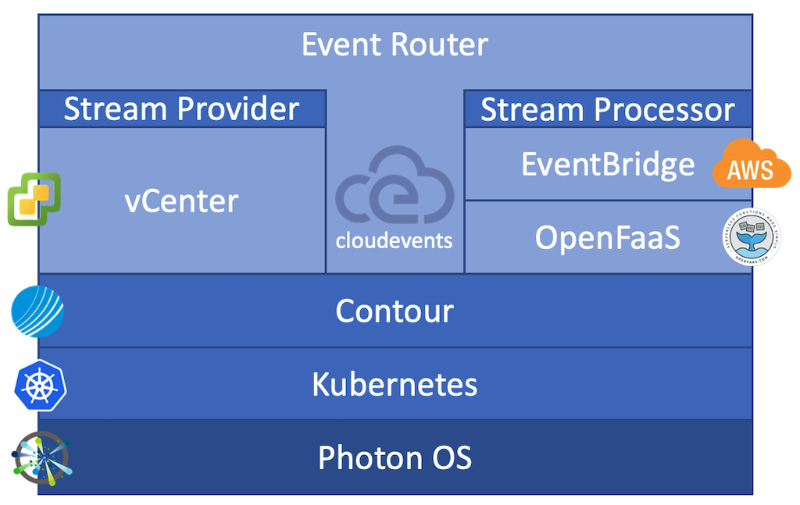

# vCenter Event Broker Appliance

## Table of Contents

- [vCenter Event Broker Appliance](#vcenter-event-broker-appliance)
  - [Table of Contents](#table-of-contents)
  - [Description](#description)
  - [Users and Use Cases](#users-and-use-cases)
  - [Getting Started](#getting-started)
  - [Architecture](#architecture)
  - [Join Conversation](#join-conversation)
  - [Contributing](#contributing)
  - [License](#license)

## Description

The [vCenter Event Broker Appliance Fling](https://flings.vmware.com/vcenter-event-broker-appliance#summary) enables customers to easily create [event-driven automation based on vCenter Server Events](https://octo.vmware.com/vsphere-power-event-driven-automation/). For example, vCenter Event Broker Appliance can drive basic workflows like automatically attaching a vSphere tag when a virtual machine (VM) is created. Even more powerful integrations between datacenter-internal enterprise services and cloud services, for example Slack and Pager Duty, can be created with vCenter Event Broker Appliance out of the box.

vCenter Event Broker Appliance is provided as a Virtual Appliance that can be deployed to any vSphere-based infrastructure, including an on-premises and/or any public cloud environment, running on vSphere such as VMware Cloud on AWS or VMware Cloud on Dell-EMC.

With this appliance, end-users, partners and independent software vendors only have to write minimal business logic without going through a steep learning curve understanding vSphere APIs. As such, we believe this solution not only offers a better user experience in solving existing problems for vSphere operators. More importantly, it will enable new integration use cases and workflows to grow the vSphere ecosystem and community, similar to what AWS has achieved with AWS Lambda.

To learn more about the vCenter Event Broker Appliance, [Michael Gasch](https://github.com/embano1) and [William Lam](https://github.com/lamw/) of VMware recently presented a session at VMworld called ["If This Then That" for vSphere- The Power of Event-Driven Automation](https://videos.vmworld.com/global/2019/videoplayer/29523) (free VMworld account login is required to view).

## Users and Use Cases

Hear from the community on how they are taking advantage of the vCenter Server Appliance [here](users-and-use-cases.md)

## Getting Started

Please refer to the getting started guide [here](getting-started.md)

## Architecture

The vCenter Event Broker Appliance follows a highly modular approach, using Kubernetes and containers as an abstraction layer between the base operating system ([Photon OS](https://github.com/vmware/photon)) and the required application services. Currently the following components are used in the appliance:

- Photon OS ([Github](https://github.com/vmware/photon))
- Kubernetes ([Github](https://github.com/kubernetes/kubernetes))
- Contour ([Github](https://github.com/projectcontour/contour))
- OpenFaaS ([Website](https://www.openfaas.com/))
- vCenter Connector ([Github](https://github.com/openfaas-incubator/vcenter-connector/))

For more details about the individual components and how they are used in the vCenter Event Broker Appliance, please see the [design page](DESIGN.md).

## Join Conversation

We are also on Slack if you would to engage with us and the community. You can find us on [#vcenter-event-broker-appliance](https://vmwarecode.slack.com/archives/CQLT9B5AA) which is part of the [VMware {Code}](https://code.vmware.com/web/code/join) Slack instance.

## Contributing

The vCenter Event Broker Appliance team welcomes contributions from the community.

Before you start working with the vCenter Event Broker Appliance, please read our [Developer Certificate of Origin](https://cla.vmware.com/dco). All contributions to this repository must be signed as described on that page. Your signature certifies that you wrote the patch or have the right to pass it on as an open-source patch.

To help you get started making contributions to vCenter Event Broker Appliance, we have collected some helpful best practices in the [Contributing guidelines](CONTRIBUTING.md).

For folks interested in contributing or enhancing vCenter Event Broker Appliance, you can build the vCenter Event Broker Appliance from source. Please refer to the getting started build guide [here](getting-started-build.md).

## License

vCenter Event Broker Appliance is available under the BSD-2 license. Please see [LICENSE.txt](LICENSE.txt).
